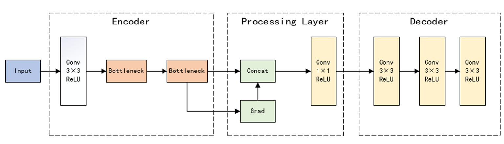

# 红外与可见光图像融合研究

## 架构图

训练时，使用源图像作为损失函数的 target，训练我们的自动编码器，流程架构如下：

自动编码器训练完成后，可以对图像进行自动分解和重建，其中我们对于分解后的特征图梯度进行 max 策略融合，流程架构如下：

## 结果对比

左图为基于 max 融合策略的结果，右图为基于梯度转移的融合结果。

## 结论

我们注意到现有的深度学习融合方法会使图像变灰变暗，所以我们基于 max 融合策略使用 CNN 实现了梯度转移方法，在保留目标显著性的基础上，保留更多的纹理细节。
